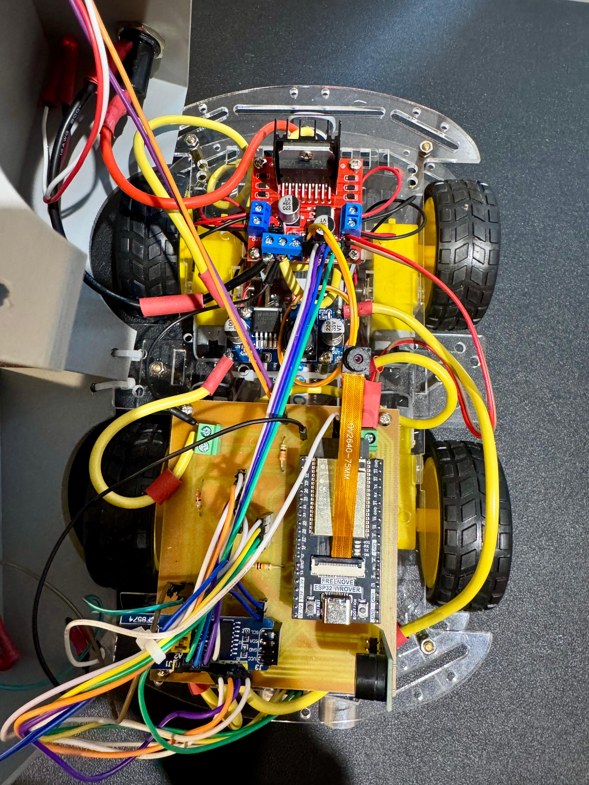

# GestroDrive 🚗✋  
*A Gesture-Controlled Robotic Car with Real-Time Video & IoT Features*  

🎥 **[Watch the Demo Video](https://youtu.be/yabmje5PNzs)**  

---

## 📌 About the Project  
GestroDrive is a **capstone project** that demonstrates how **human gestures** can be translated into real-time robotic car control.  
Using **ESP32 microcontrollers**, **MPU6050 motion sensors**, and an **ESP32-CAM**, this system combines embedded programming, IoT concepts, and robotics into one seamless prototype.  

The car can be controlled entirely by hand gestures, while providing **live video streaming** and built-in **safety mechanisms** such as crash detection and auto-stop.  

---

## 🚀 Key Features  
- ✋ **Gesture Recognition** – Control the car with natural hand motions (Forward, Backward, Left, Right, Stop).  
- 📷 **Live Video Feed** – ESP32-CAM streams MJPEG video for first-person driving.  
- 🌐 **Web Dashboard** – Browser-based interface for manual control and telemetry.  
- 🚨 **Crash Detection** – Ultrasonic sensor stops the car if an obstacle is detected.  
- 💡 **Smart Lighting** – Auto headlights and taillights using LDR sensors.  
- 🔊 **Safety Alerts** – Buzzer sounds on crash detection or system faults.  

---

## 🛠️ Tech Stack  

### Hardware  
- **Hand Unit**: ESP32-DevKitC, MPU6050, SSD1306 OLED, 3.7V LiPo + TP4056 + MT3608  
- **Car Unit**: ESP32-CAM (OV2640, WROVER PSRAM), L298N Motor Driver, PCF8574 I/O Expander  
- **Peripherals**: HC-SR04 Ultrasonic, LDRs + LEDs, Buzzer, 7.4V LiPo + LM2596 Buck Converter  

### Software  
- **Frameworks**: Arduino (via PlatformIO)  
- **Networking**: ESP-NOW (gesture commands), Wi-Fi (video stream, dashboard)  
- **Protocols & Tools**: mDNS for local access (`cam.local`), AsyncWebServer, I2C for sensors  

---

## 📂 Repository Structure  

```text
GestroDrive/
│
├── Car-Code/                  # ESP32-CAM firmware
│   ├── platformio.ini
│   └── src/
│       └── main.cpp
│
├── Hand-Code/                 # ESP32 Hand Controller firmware
│   ├── platformio.ini
│   └── src/
│       └── main.cpp
│
├── Dashboard/                 # Web dashboard for control & telemetry
│   ├── index.html
│   └── README.md
│
├── Docs/                      # Documentation & media
│   ├── Report.pdf
│   ├── What-I-Learned-Summary.md
│   ├── Setup-Notes.md
│   └── Images/
│       ├── Car.jpg
│       ├── CarV2.jpg
│       ├── HandUnit.jpg
│       ├── HandUnitV2.jpg
│       └── Image.jpg
│
└── README.md                  # Project overview (this file)

```
---

## ⚙️ Hardware Setup
**Hand Unit**
- ESP32-DevKitC  
- MPU6050 (I²C: SDA=21, SCL=22)  
- SSD1306 OLED display  
- 3.7V LiPo battery + TP4056 charger + MT3608 boost  

**Car Unit**
- ESP32-CAM (OV2640 camera, WROVER module with PSRAM)  
- L298N motor driver + PCF8574 I/O expander  
- HC-SR04 ultrasonic sensor  
- LDRs + LEDs for headlights/taillights  
- Buzzer for alerts  
- 7.4V 2S LiPo battery + LM2596 buck converter  

**Networking**
- ESP-NOW: Hand → Car (gesture commands)  
- Wi-Fi: Car joins local Wi-Fi (SSID = `ESPTEST`)  
- mDNS: Camera accessible via `http://cam.local`  

---

## 💻 Software Setup
- **HandUnit**: PlatformIO, Arduino framework, COM4 @ 115200 baud  
- **CarUnit**: PlatformIO, Arduino framework, COM7 @ 115200 baud  
- **Dashboard**: `index.html` served locally or embedded into ESP32 FS  

**Key Libraries**
- Adafruit MPU6050, SSD1306, GFX  
- ESPAsyncWebServer, AsyncTCP  
- esp_camera, PCF8574  

---

## 🚀 Features
- **Gesture Control**: Forward, Backward, Left, Right, Stop  
- **Web Dashboard**: Toggle between Gesture & Web mode, live telemetry, manual control buttons  
- **Live Video**: MJPEG streaming via `/stream` endpoint  
- **Crash Detection**: Stop if obstacle ≤30 cm for ≥150 ms, buzzer alert  
- **Lighting**: Auto headlights from LDR readings  

---

## 📖 Documentation
- **[Report (PDF)](Docs/Report.pdf)** – complete technical report  
- **[What I Learned Summary](Docs/What-I-Learned-Summary.md)** – technical learning outcomes  
- **[Setup Notes](Docs/Setup-Notes.md)** – hardware/software setup guide  

---

## 👥 Team
- [Arth Raval](https://github.com/arth-7)  
- [Vansh Dave](https://github.com/vdave18)

---

## 📜 License
This project is released under the **MIT License** – free to use and modify.  

---
